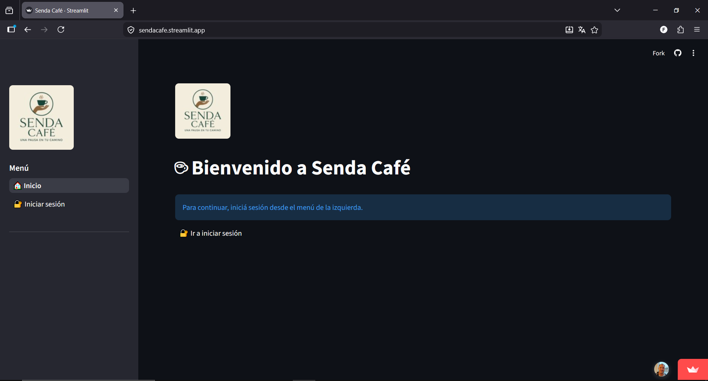
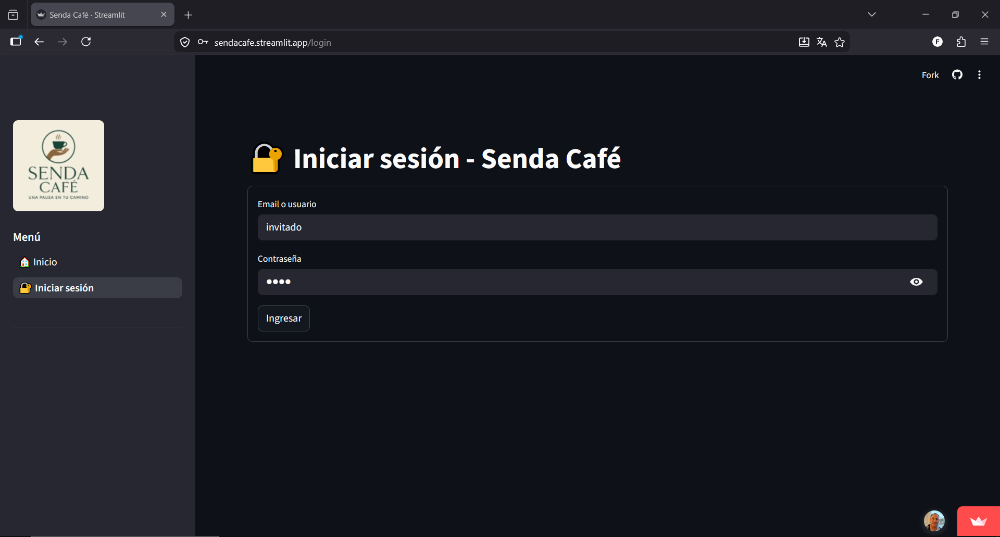
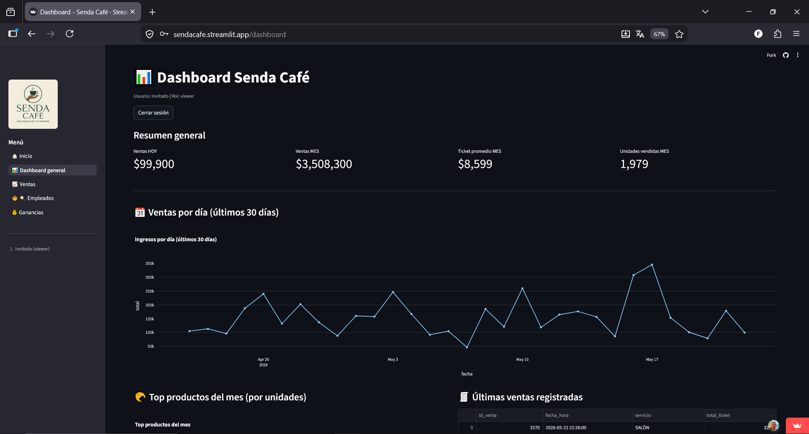
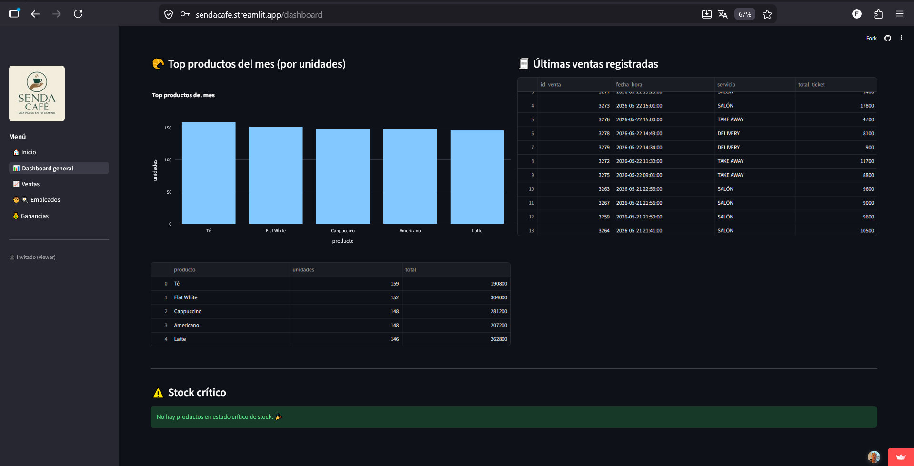
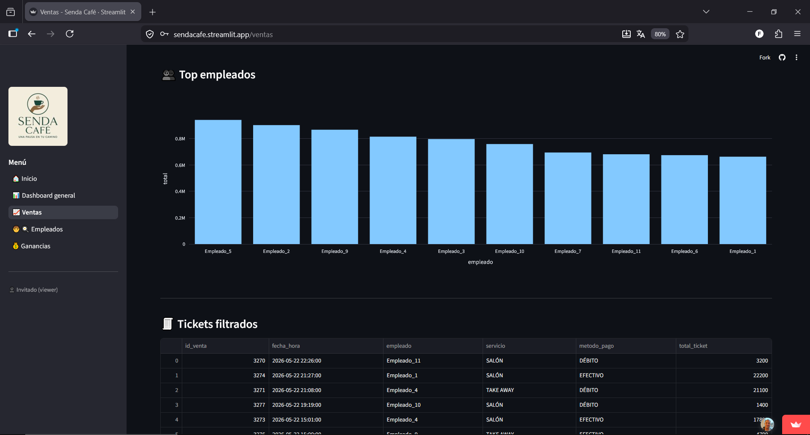
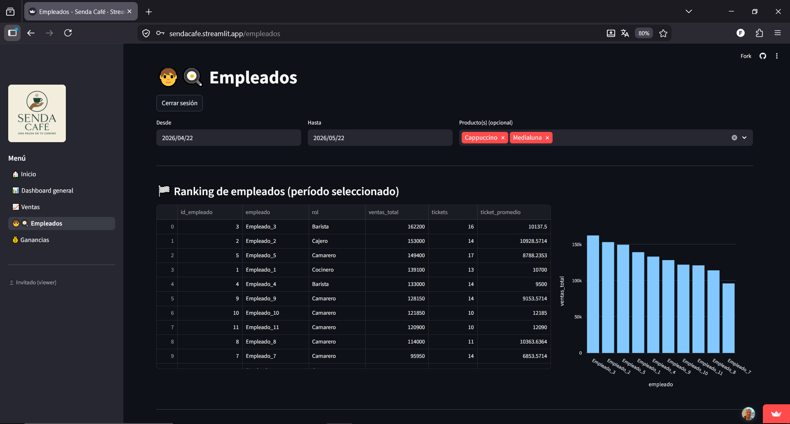
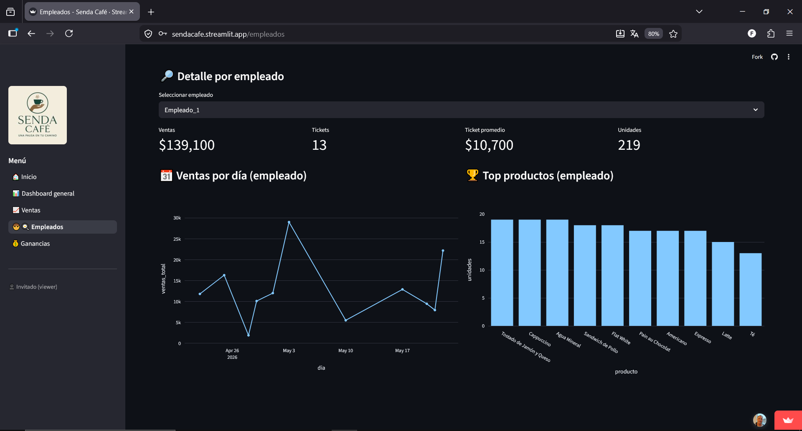
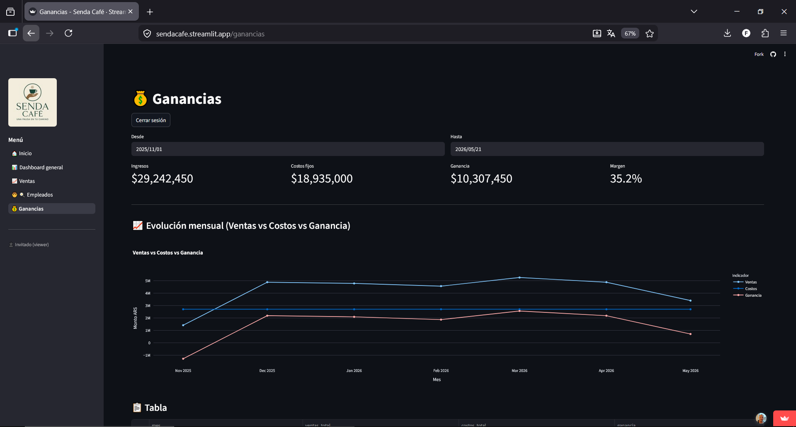
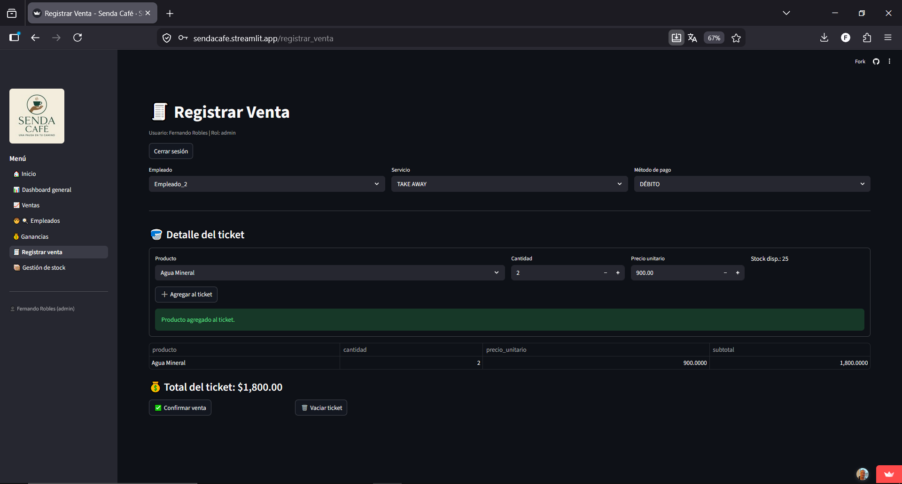
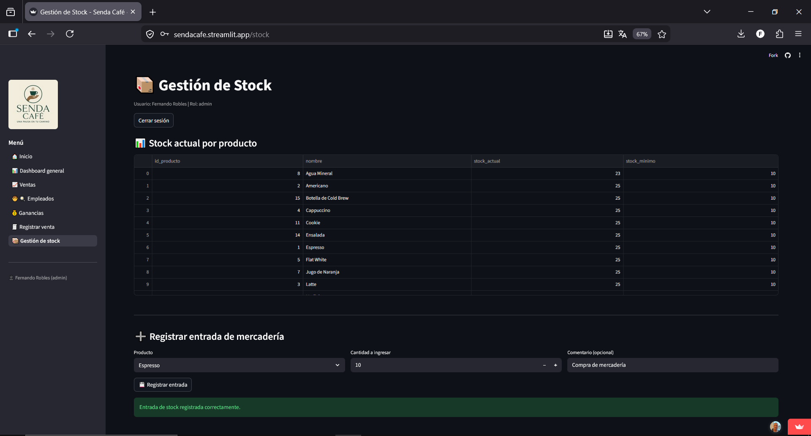

# ☕ Senda Café

Plataforma web de análisis y gestión operativa para cafeterías y pequeños comercios gastronómicos.

Senda Café centraliza métricas comerciales, control de stock, visualización de KPIs y análisis financiero en una aplicación web interactiva desarrollada con Python y PostgreSQL.

---

# 🚀 Demo Online

👉 https://sendacafe.streamlit.app/

---

# 👤 Usuario Demo (Solo lectura)

### Rol: `viewer`

```txt
Usuario: invitado
Contraseña: Cafe
```

✅ Puede:
- navegar dashboards
- visualizar métricas
- usar filtros
- consultar ventas y ganancias

❌ No puede:
- registrar ventas
- modificar stock
- realizar cambios operativos

---

# 🧩 Roles del sistema

| Rol | Permisos |
|---|---|
| admin | Acceso total |
| owner | Gestión operativa y análisis |
| viewer | Solo visualización y dashboards |

---

# 📊 Funcionalidades principales

- 🔐 Login con autenticación y control de roles
- 📈 Dashboard interactivo de ventas
- 💰 Análisis de ganancias
- 📦 Gestión de stock
- 🧑‍🍳 Gestión de empleados
- 📊 KPIs de negocio
- 📅 Filtros dinámicos por fechas
- ☁️ Deploy cloud
- 🗄️ PostgreSQL en Neon
- 📉 Visualizaciones con Plotly

---

# 🛠️ Stack Tecnológico

## Frontend / Visualización
- Python
- Streamlit
- Plotly
- Pandas

## Backend / Lógica
- Python
- Psycopg2
- bcrypt

## Base de Datos
- PostgreSQL
- Neon Tech

## Cloud
- Streamlit Cloud
- Neon PostgreSQL

---

# 🏗️ Arquitectura del Proyecto

```txt
SendaCafeApp/
│
├── app.py
│
├── pages/
│   ├── dashboard.py
│   ├── ventas.py
│   ├── ganancias.py
│   ├── empleados.py
│   ├── stock.py
│   ├── registrar_venta.py
│   └── login.py
│
├── data/
│   ├── db.py
│   ├── ventas_queries.py
│   └── usuarios_queries.py
│
├── services/
│   ├── ui_helpers.py
│   └── alerts.py
│
├── core/
│   └── config.py
│
├── assets/
│   └── screenshots/
│
└── requirements.txt
```

---

# 📸 Capturas del Proyecto

---

## 🔐 Login

### Vista principal


### Inicio de sesión


---

# 📊 Dashboard General

### Dashboard principal


### Dashboard ampliado


---

# 📈 Ventas

### KPIs y filtros


### Visualización de ventas


### Tabla de tickets


---

# 🧑‍🍳 Empleados

### Dashboard empleados


### Métricas de empleados


---

# 💰 Ganancias

### Evolución mensual


---

# 📦 Funciones Operativas (Admin / Owner)

## 🧾 Registro de ventas


## 📦 Gestión de stock


---

# 📈 Objetivo del Proyecto

El objetivo de Senda Café es demostrar una arquitectura funcional para la gestión y análisis de datos de un comercio gastronómico utilizando tecnologías modernas orientadas a:

- análisis de negocio
- visualización de KPIs
- control operativo
- gestión cloud
- dashboards interactivos

---

# ☁️ Infraestructura

| Servicio | Tecnología |
|---|---|
| Frontend | Streamlit |
| Base de datos | PostgreSQL |
| Cloud DB | Neon |
| Hosting | Streamlit Cloud |

---

# 🔒 Seguridad

- Autenticación con bcrypt
- Roles de usuario
- Restricción de permisos según perfil
- Variables sensibles mediante Secrets

---

# 🔮 Mejoras Futuras

- API REST con FastAPI
- Arquitectura SaaS multi-sucursal
- Exportación PDF / Excel
- Alertas automáticas
- Dashboard mobile
- POS táctil
- IA predictiva
- Métricas avanzadas

---

# 👨‍💻 Autor

Fernando Robles

- GitHub: https://github.com/ferroblesmdq12/SendaCafeApp
- Deploy: https://sendacafe.streamlit.app/

---

# ⭐ Proyecto orientado a Portfolio Profesional

Este proyecto fue desarrollado como una plataforma demostrativa enfocada en:

- Data Analytics
- Business Intelligence
- Python Development
- Cloud Applications
- PostgreSQL
- Dashboarding
- Role-Based Access
- Full Stack Data Apps
